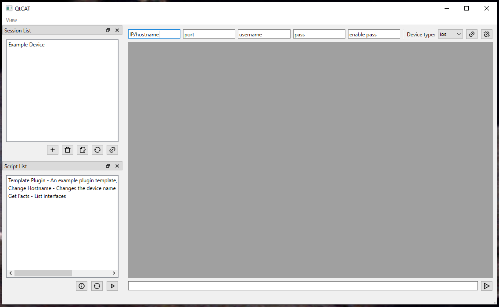

# Qt Cisco Automation Tool

This app is currently in alpha.

A multi-tabbed GUI for running NAPALM/Netmiko automation scripts/plugins on saved device sessions.

### Help:

To install the dependencies, navigate to this project's root directory and run "pip3 install -r requirements.txt"

Plugins/scripts must be placed in './plugins'. Plugins require a '.yapsy-plugin' file containing information about the plugin.

For an example plugin, see 'template_plugin.py'

### Screenshot:

